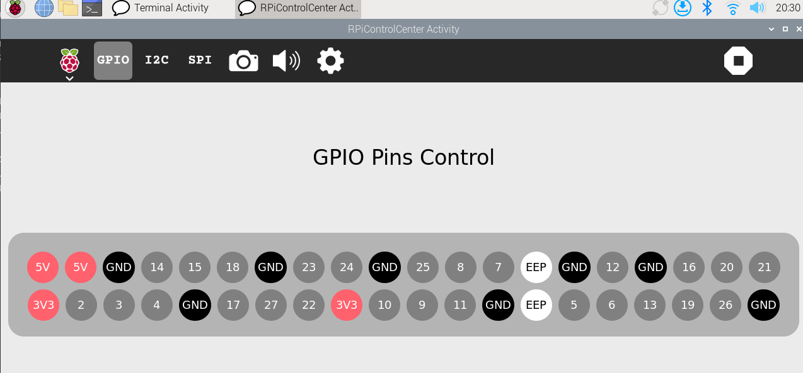

# RPi Control Center

A control center application for Raspberry Pi, designed to manage and monitor various Raspberry Pi functionalities through a user-friendly interface.



## Features
- **System Monitoring**: View system information such as CPU usage, memory usage, and disk space.
- **Process Management**: Monitor and manage running processes.
- **Network Monitoring**: View network statistics and active connections.
- **GPIO Control**: Control the GPIO pins on the Raspberry Pi.

## Requirements
- Raspberry Pi with Raspbian OS
- Python 3.x
- Required Python libraries:
  - `gi`
  - `psutil`
  - `RPi.GPIO`

## Installation
- Install the required libraries: See req.txt files for the required libraries.

## Usage
- Run the application using the following command:
  ```
  python3 activity.py
  ```
## License

- This project is licensed under the GPL-2.0 License.